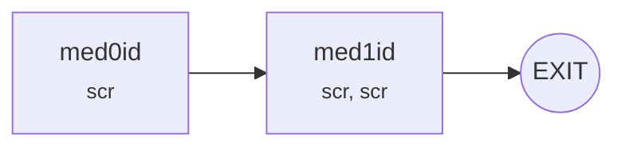
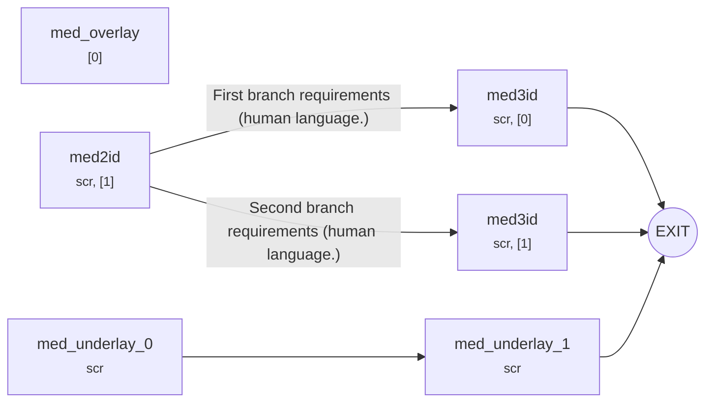
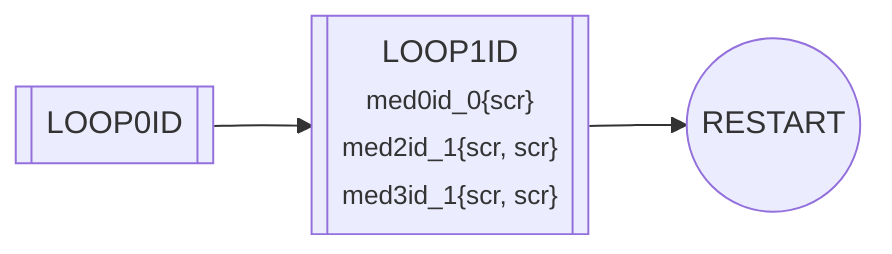
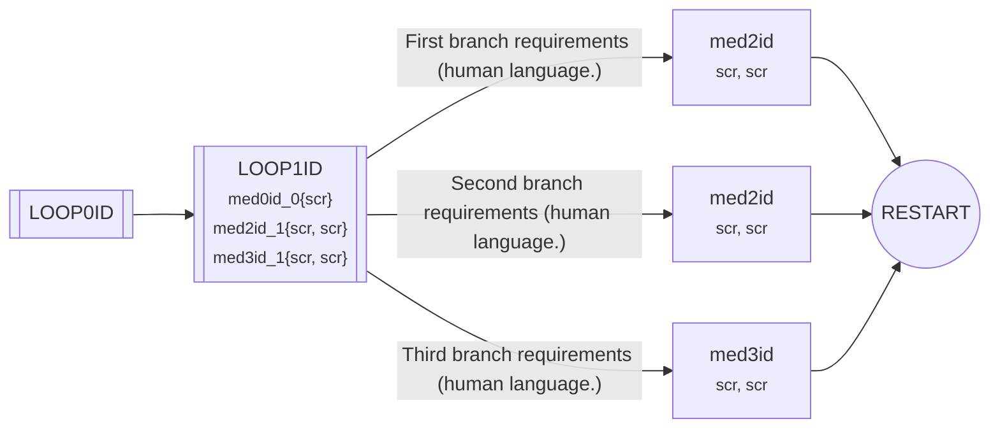

# mvn-<id\>

<!--Can use html comments anywhere in the document. However, they should be considered "for document development" and not needed for reading of the final document. Will not appear on certain renderers.-->

## Title

\<The working title goes here.\>

## Description

\<A concise description of the project goes here.\>

### Visuals

#### <First Visual Group>

<TODO>

## Lore

### People

- **Actor:** Short description of **Actor**.

### Places

- **Place:** Short description of **Place**.

### Things

- **Thing:** Short description of **Thing**.

## Cited Data

<!--Data that is referenced in this design document. This is *not* a comprehensive list of data in the novel.-->

- **data_0:** Describe any important information about **data_0**.
- **data_1:** Describe any important information about **data_1**.

## Scripts

### <extension>

#### 0

- **<Entry>:** Description.

## Flow

### LOOP0ID

### LOOP1ID

#### **PARAMS:** med0id_0[1], med2id_1[2], med3i_1[2]

<!--NOTE: Overlays can also be drawn *under* the main medium... Technically these are "underlays", but they are functionally identical other than draw order.-->

---

### DEMO

<!--The process loop for the demo version.-->

### MAIN

<!--The process loop for the main version.-->

